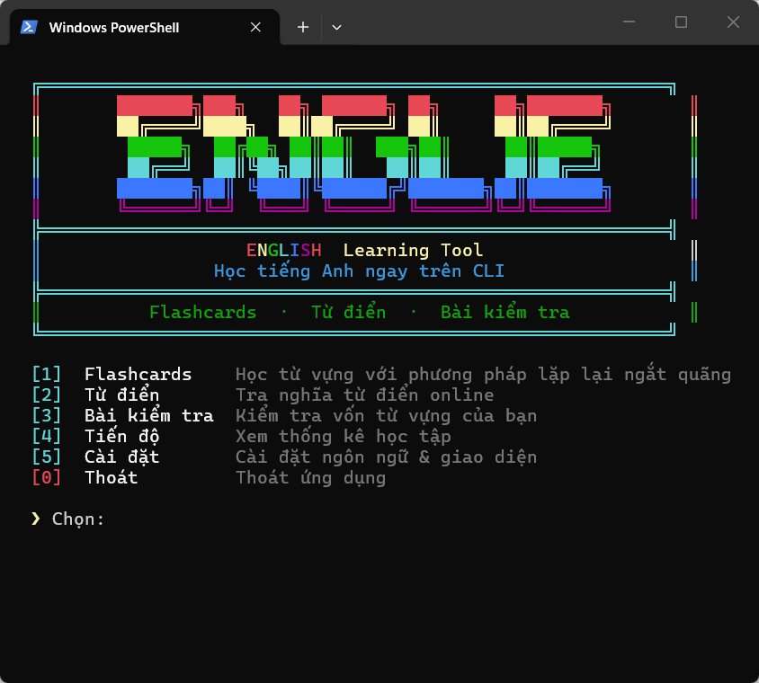

# English Learning Tool

A CLI English learning tool with flashcards, dictionary lookup, and multiple-choice quiz. Features a modern terminal UI with rainbow banners, progress tracking, and Vietnamese language support.



## Features

- **Flashcards** — Spaced repetition (intervals: 0→1→3→7→14→30 days), yes/no tracking
- **Dictionary** — Lookup any English word via Free Dictionary API, with Vietnamese meaning when available
- **Quiz** — 10-question multiple choice, score tracking, spaced repetition feedback
- **Progress** — Track learned words, review statistics
- **Multilingual** — English / Vietnamese toggle

## Requirements

- **Python 3.8+** (no external dependencies)

## Usage

```bash
cd english-tool
python main.py
```

### Menu
1. **Flashcards** — Review due words
2. **Dictionary** — Look up a word
3. **Quiz** — Take a quiz
4. **Progress** — View learning stats
5. **Settings** — Change language

## Project Structure

```
english-tool/
├── main.py                 # Entry point & menu loop
├── modules/
│   ├── ui.py               # Terminal UI (colors, boxes, word-wrap)
│   ├── lang.py             # i18n translations
│   ├── utils.py            # Data load/save, spaced repetition, stats
│   ├── flashcard.py        # Flashcard sessions
│   ├── dictionary.py       # Dictionary lookup
│   └── quiz.py             # Quiz sessions
├── data/
│   ├── words.json          # 20 sample English words
│   └── user_data.json      # Auto-created learning progress
├── images/
│   └── english-tool.png    # Screenshot
└── requirements.txt
```

## License

MIT
