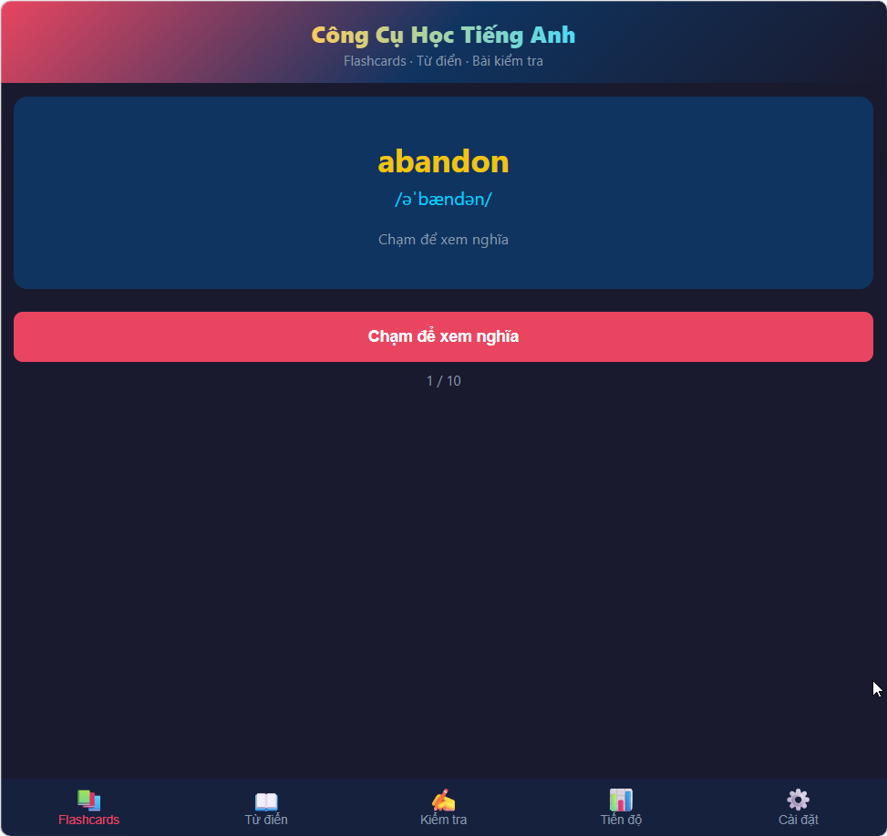

# English Learning Tool

A CLI + Web English learning tool with flashcards, dictionary lookup, and multiple-choice quiz. Features a modern terminal UI with rainbow banners, a mobile-friendly PWA web app, progress tracking, and Vietnamese language support.




## Features

- **Flashcards** — Spaced repetition (intervals: 0→1→3→7→14→30 days), yes/no tracking + typing mode
- **Dictionary** — Lookup any English word via Free Dictionary API, with Vietnamese meaning + auto-translated definitions
- **Quiz** — 10-question multiple choice, score tracking, spaced repetition feedback
- **Progress** — Track learned words, review statistics & daily reviews
- **Word Browser** — Browse/search all words, filter by learned/new, tap to look up
- **TTS Pronunciation** — Listen to any word via browser's speech synthesis
- **Bilingual** — English definitions + Vietnamese translations side by side
- **Multilingual** — English / Vietnamese toggle
- **Web App (PWA)** — Mobile-friendly UI, installable on phone home screen

## Requirements

- **Python 3.8+** (no external dependencies)

## Usage

### CLI Mode
```bash
cd english-tool
python main.py
```

### Web Mode (Mobile/Desktop)
```bash
cd english-tool
python server.py
```
Open `http://localhost:8000` in your browser.

For phone access, find your computer's LAN IP (e.g. `192.168.1.x`) and open `http://<ip>:8000` from your phone. On Android Chrome / iOS Safari, tap **Add to Home Screen** to install as an app.

### CLI Menu
1. **Flashcards** — Review due words
2. **Dictionary** — Look up a word
3. **Quiz** — Take a quiz
4. **Progress** — View learning stats
5. **Settings** — Change language

### Web Tabs
- 📚 **Flashcards** — Tap to reveal / Type the meaning mode, TTS pronunciation
- 📖 **Dictionary** — Search any English word with Vietnamese meaning + auto-translated definitions
- ✍️ **Quiz** — Multiple choice with instant feedback
- 📊 **Progress** — Learning stats with progress bar & daily reviews
- 📝 **Words** — Browse all words, search, filter by learned/new
- ⚙️ **Settings** — Language toggle (English / Tiếng Việt)

## Project Structure

```
english-tool/
├── main.py                 # CLI entry point & menu loop
├── server.py               # Web server (stdlib http.server)
├── web/
│   ├── index.html          # SPA frontend (embedded CSS + JS)
│   ├── manifest.json       # PWA manifest
│   └── sw.js               # Service worker
├── modules/
│   ├── ui.py               # Terminal UI (colors, boxes, word-wrap)
│   ├── lang.py             # i18n translations (EN / VI)
│   ├── utils.py            # Data load/save, spaced repetition, stats
│   ├── flashcard.py        # Flashcard sessions
│   ├── dictionary.py       # Dictionary lookup
│   └── quiz.py             # Quiz sessions
├── data/
│   ├── words.json          # 20 sample English words
│   └── user_data.json      # Auto-created learning progress
├── images/
│   └── english-tool.png    # CLI screenshot
└── requirements.txt
```

## License

MIT
